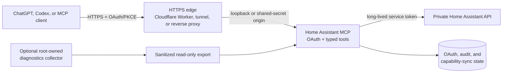

<!-- markdownlint-disable MD013 -->

# Home Assistant MCP

[](https://github.com/shogun301/ha-chatgpt-mcp/actions/workflows/public-safety.yml)

An OAuth-protected
[Model Context Protocol (MCP)](https://modelcontextprotocol.io/) server for
securely connecting ChatGPT, Codex, and other MCP clients to Home Assistant.

The project exposes 110 typed tools for discovery, dashboards, schedules,
climate, energy, media, cleaning, irrigation, automations, diagnostics, and
carefully bounded device control. It keeps Home Assistant's API private and
deliberately avoids becoming a generic shell, log reader, network scanner, or
unrestricted service proxy.

> [!IMPORTANT] This is a security-sensitive reference implementation for a
> self-hosted Home Assistant installation. Read the
> [security model](#security-model), replace every example value, and review the
> allowlists before connecting it to a real home.

## Highlights

- **Typed Home Assistant access:** entities, devices, areas, history, weather,
  calendars, schedules, statistics, integrations, dashboards, to-do lists,
  automations, backups, and system health.
- **Bounded writes:** climate, lights, scenes, media players, vacuums, covers,
  locks, sirens, notifications, dashboards, schedules, calendars, to-do items,
  and automations use validated inputs and narrow service allowlists.
- **Sprinkler support:** evidence-labelled controller and command status,
  advanced zone configuration, modeled moisture, rolling per-zone history,
  native schedule/upcoming-run reads, weather/skip decisions, exact-second zone
  or sequence starts, confirmed logical-run pause/resume/current-zone skip,
  and idempotent stop operations.
- **Energy and SolarEdge:** production, module comparison, power flow, energy
  breakdowns, storage summaries, telemetry, alerts, and a versioned Home
  Assistant bridge with privacy-filtered scalar entities and durable export
  event history.
- **Persistent capability sync:** compares Home Assistant's current service
  registry with the reviewed release baseline every five minutes and reports
  drift without dynamically exposing new writes.
- **Sanitized diagnostics:** optional fixed-route, host/runtime, outage, and
  fixed-subnet LAN evidence with strict limits and no raw addresses, arbitrary
  targets, commands, or device control.
- **OAuth-native remote access:** authorization code flow with S256 PKCE,
  dynamic client registration, scoped access tokens, and MCP resource metadata.

Version **2.7.9** currently advertises **110 tools**. See
[CHANGELOG.md](CHANGELOG.md) for release history.

## Architecture



The reference deployment binds the MCP service to `127.0.0.1:8000`. Only the
HTTPS edge is public. Home Assistant can remain local to the host or reachable
over a private network.

## Tool surface

| Area                      | Examples                                                                  | Access                                   |
| ------------------------- | ------------------------------------------------------------------------- | ---------------------------------------- |
| Home model                | Entities, devices, areas, registry, history, weather                      | Read                                     |
| Dashboards and statistics | List/read/create/update dashboards; long-term statistics                  | Read/write                               |
| Climate and schedules     | Targets, modes, fan modes, presets, weekly schedules, time helpers        | Read/write                               |
| Media and cleaning        | Browse/play media, TTS, Cast dashboards, vacuum rooms and fan speed       | Read/write                               |
| Irrigation                | Status, zones, history, schedules, exact runs, pause/resume/skip/stop | Read/write                               |
| Organization              | Calendars, to-do lists, automations, notifications                        | Read/write                               |
| Energy                    | SolarEdge summaries, power flow, storage, telemetry, and alerts           | Read; optional authorization write       |
| Operations                | Backups, capability drift, fixed routes, host/runtime, outages, LAN nodes | Read; backup creation is confirmed write |

Higher-risk actions are annotated as destructive and require an explicit
confirmation argument. The exact registry is authoritative; inspect it from an
authenticated MCP client after deployment.

## Requirements

- Home Assistant reachable from the MCP host.
- A dedicated Home Assistant long-lived access token. Use a separate service
  identity when possible.
- Python 3.12 or newer and [uv](https://docs.astral.sh/uv/) for development and
  tests.
- Docker with Compose for the reference container deployment.
- A public HTTPS URL for remote MCP clients.
- An HTTPS edge that reaches the MCP over loopback or injects the configured
  origin shared secret. The included Caddy and Cloudflare examples demonstrate
  those two patterns.
- Linux and systemd only if using the optional host diagnostics collector.

The bundled Compose file is a production reference, not a universal one-command
installer. It assumes host networking, an existing Home Assistant configuration
at `/opt/homeassistant/config`, and an installed diagnostics export at
`/var/lib/ha-host-diagnostics/export`. Adapt those mounts to your installation
without exposing the Home Assistant API or Docker socket.

## Quick start for development

Clone the repository and install the locked dependencies:

```bash
git clone https://github.com/shogun301/ha-chatgpt-mcp.git
cd ha-chatgpt-mcp
uv sync --frozen
```

The test suite and public-source audit do not need production credentials:

```bash
uv run python scripts/release_integrity.py
uv run python scripts/public_release_audit.py --history
uv run --with pytest python -m pytest tests collector/tests home_assistant/tests
```

To run the service, copy `.env.example` to an ignored `.env`, replace every
example domain and entity ID, and provide the required runtime paths and secret
files described below. The application does not automatically load `.env`;
export the variables in your process manager, use `uvicorn --env-file .env`, or
let Docker Compose load it.

For a local process after configuring the environment:

```bash
uv run uvicorn app.server:app --host 127.0.0.1 --port 8000 --no-proxy-headers
```

For the reference container deployment after adapting its mounts and optional
integrations:

```bash
docker compose build --pull
docker compose up -d
curl --fail http://127.0.0.1:8000/healthz
```

Do not bind Uvicorn directly to a public interface.

## Configuration

### Core settings

| Variable                | Purpose                                                                                  |
| ----------------------- | ---------------------------------------------------------------------------------------- |
| `PUBLIC_BASE_URL`       | Public HTTPS base URL for the MCP service; clients connect to `/mcp`.                    |
| `FRONTEND_PUBLIC_URL`   | Public Home Assistant frontend URL used only by fixed-route diagnostics.                 |
| `MCP_ALLOWED_HOSTS`     | Comma-separated public hostnames accepted by the transport.                              |
| `HA_BASE_URL`           | Private Home Assistant origin, such as `http://127.0.0.1:8123`.                          |
| `MCP_LOCAL_BASE_URL`    | Loopback MCP origin used by fixed-route comparisons.                                     |
| `MCP_DISPLAY_NAME`      | Name shown in OAuth and MCP metadata.                                                    |
| `DATABASE_PATH`         | Writable SQLite path for OAuth state.                                                    |
| `AUDIT_LOG_PATH`        | Writable JSONL audit path.                                                               |
| `HA_CONFIG_PATH`        | Read-only Home Assistant configuration mount used for safe backups and reads.            |
| `BACKUP_PATH`           | Writable directory for pre-change configuration backups.                                 |
| `HOST_DIAGNOSTICS_PATH` | Read-only sanitized collector export; optional diagnostics report unavailable if absent. |

Entity-specific variables in `.env.example` map the generic tool surface to one
deployment's presence, notification, vacuum, sprinkler, thermostat, and schedule
entities. Keep real entity IDs in local configuration, not in Git.

Sprinkler controller entities and zone entities may use different prefixes;
configure `SPRINKLER_ENTITY_PREFIX` and `SPRINKLER_ZONE_ENTITY_PREFIX`
respectively. Forecast-adjusted irrigation automations may use only the
logical-run `wyzeapi.run_sprinkler_sequence`, `pause_sprinkler`,
`resume_sprinkler`, and `stop_sprinkler` services, targeted to the exact current
controller device with bounded literal zone and runtime inputs. Set
`AUTOMATION_DAILY_FORECAST_ENTITY` to one exact weather entity to allow a daily
`weather.get_forecasts` request with a bounded literal response variable.

Wyze's private sprinkler API has no stable official programming contract. The
bundled [`home_assistant/wyzeapi_overlay`](home_assistant/wyzeapi_overlay/README.md)
adds four response-only services, seven bounded command services, and preserves exact native identifiers while
normalizing zones as `zone-1` through `zone-8`. Every sprinkler output labels
its evidence as commanded, controller-reported, calculated, inferred, or
physically measured. Current state is never described as physical valve-open
feedback. Home Assistant owns every logical run timer and ordered queue: it
stops at the requested second, requires controller-reported idle before
advancing, and retains the current remainder and queue while paused. See the
[capability matrix](docs/wyze-sprinkler-capability-matrix.md) for confirmed
semantics and upstream limits.

MCP clients should read `get_sprinkler_command_status.logical_run` before a
pause, resume, or skip when eligibility is not already known. The dedicated
tools accept only `confirmed`; each requires explicit current-turn confirmation,
is non-idempotent, and must not be retried automatically. Read status once after
submission. `skip_sprinkler_zone` stops the current zone and advances only an
active dashboard-owned multi-zone Quick Run with a queued next zone. It does not
skip a native scheduled program and is excluded from generic service routing and
automation construction.

### Required secret files

The server reads secrets from files rather than environment values:

| Variable                    | File contents                                     |
| --------------------------- | ------------------------------------------------- |
| `HA_TOKEN_FILE`             | Dedicated Home Assistant long-lived access token. |
| `OAUTH_PASSWORD_HASH_FILE`  | Argon2 hash for the human OAuth sign-in password. |
| `JWT_SECRET_FILE`           | Random secret used to sign access tokens.         |
| `ORIGIN_SHARED_SECRET_FILE` | Random secret shared only with the HTTPS edge.    |

Generate random values with a cryptographically secure generator. An Argon2
password hash can be produced without placing the password in shell history:

```bash
uv run python -c "from argon2 import PasswordHasher; from getpass import getpass; print(PasswordHasher().hash(getpass('OAuth password: ')))"
uv run python -c "import secrets; print(secrets.token_urlsafe(48))"
```

Store the outputs in separate files with owner-only permissions. Never commit
`secrets/`, `.env`, tokens, passwords, hashes, private domains, entity
inventories, schedules, or network topology.

### Optional SolarEdge configuration

SolarEdge support uses optional client credentials, an encrypted token store,
bridge secret, redirect URI, and guarded portal fallback credentials. If you do
not use SolarEdge, omit the corresponding `SOLAREDGE_*_FILE` variables. The
reference Compose file sets those paths, so either provide the files or remove
those entries in your local override.

### OAuth scopes

- `mcp:read` permits read tools.
- `mcp:write` permits the reviewed write surface and also satisfies the current
  strongest compatibility grant.
- `mcp:diagnostics`, together with `mcp:read`, permits privileged read-only host
  and LAN diagnostics without granting device writes.

Connect clients to `https://your-mcp-host.example/mcp`. The server publishes
OAuth authorization-server, protected-resource, OpenID configuration, and
dynamic client-registration metadata under the same origin.

## Edge options

The application requires non-loopback requests to carry the configured origin
shared secret. Two examples are included:

- [`cloudflare/`](cloudflare/) contains a narrow Cloudflare Worker proxy. It
  forwards only the MCP, OAuth, health, and SolarEdge callback paths, enforces a
  1 MiB request limit, adds the origin secret, and strips unnecessary headers.
- [`Caddyfile`](Caddyfile) provides a same-host HTTPS reverse proxy to the
  loopback MCP listener.

The included `cloudflared` service uses a token file and publishes metrics on
loopback only. Replace all example routes and keep the MCP origin, Home
Assistant API, and metrics listener off the public network.

## Capability synchronization

Home Assistant integrations can add or remove services independently of this
project. The server therefore polls Home Assistant's service registry every five
minutes and persists a release-bound baseline in
`/data/ha-capability-sync.json`.

`get_capability_sync_status` reports added or removed services and field-schema
changes across restarts. The monitor is deliberately observational: it never
calls a service and never turns an unreviewed Home Assistant service into a new
MCP write tool. New functionality should be reviewed, implemented as typed
tools, tested, and released through Git.

The reviewed Hubitat integration services remain fail-closed. Lock-code
operations, arbitrary commands, alarm/security mode, delay configuration,
token-derived hub identifiers, and free-text hub mode are not exposed through
`call_service`; `list_services` reports the exclusion reason without returning
credentials or identifiers.

## Optional host and LAN diagnostics

The systemd collector under [`collector/`](collector/) has no listener and
accepts no caller-selected command, path, container, log expression, or URL. It
publishes bounded, sanitized snapshots and ledgers to a fixed directory. The MCP
container receives only that directory as a read-only mount—never the Docker
socket, host journal, procfs, sysfs, or systemd control.

The LAN tools operate only inside one configured `/24`, return opaque node IDs,
use a closed TCP-service allowlist, send no application payload, and omit raw
addresses. They cannot scan arbitrary networks or control devices.

See [docs/operations.md](docs/operations.md) and
[collector/README.md](collector/README.md) for the full data model, retention
limits, deployment, verification, incident, and rollback procedures.

## Security model

This server is intentionally narrower than the Home Assistant API:

- No shell execution, arbitrary WebSocket passthrough, arbitrary files, raw
  logs, Docker administration, service restart, shutdown, credential retrieval,
  camera imagery, or alarm disarming.
- Generic Home Assistant service calls are allowlisted by domain and service;
  dedicated typed tools are preferred.
- Inputs are schema-validated, result sizes are bounded, and sensitive
  diagnostic fields are recursively redacted.
- Destructive or physical operations use explicit annotations and confirmation
  gates.
- Audit records contain tool names and bounded metadata, not credentials or
  returned diagnostic evidence.
- The container runs as an unprivileged user with a read-only filesystem, all
  Linux capabilities dropped, and `no-new-privileges` enabled.
- The public-release audit scans both the current tree and Git history before
  publication.

Never use a thermostat, light, lock, vacuum, sprinkler, camera, speaker,
television, backup, notification, or other physical side effect as a
connectivity test.

For vulnerability reporting and handling of sensitive deployment information,
read [SECURITY.md](SECURITY.md).

## Deployment and verification

The PowerShell deployment script in
[`scripts/deploy-production.ps1`](scripts/deploy-production.ps1) is an
opinionated AWS Lightsail reference. It requires explicit AWS profile, region,
instance, frontend URL, and MCP URL parameters; requires a clean Git tree;
packages the exact reviewed commit with `git archive`; builds, hermetically
tests, and smoke-tests the immutable image; creates backups; deploys the
transactional Wyze overlay and MCP container; verifies source identity; and
supports rollback. The host collector is installed or restarted only when an
immutable three-file content hash changes, and the tunnel is recreated only
when its own configuration block or image ID changes. The overlay deployer takes a guarded backup, requires
the exact 0.1.39 base hashes, validates Python/YAML/Home Assistant configuration,
restarts only Home Assistant, calls only four response-only read services, and
restores the backup plus restarts Home Assistant on failure. The combined
deployer finishes all MCP build, image, hermetic test, and smoke-test gates
before applying the overlay immediately ahead of MCP cutover. Any later MCP
cutover or acceptance failure restores both the prior MCP image and the prior
overlay so incompatible halves are never accepted as the final state.
Read-only acceptance also reconciles all eight configured normalized MCP zones
and retained native IDs against the live integration snapshot so a successful
but truncated controller inventory cannot pass.
Review it carefully before adapting it to another host.

Before every public push or production release:

```bash
uv sync --frozen
uv run python scripts/release_integrity.py
uv run python scripts/public_release_audit.py --history
uv run --with pytest python -m pytest tests collector/tests home_assistant/tests
```

Then verify, without changing device state:

1. `/healthz` succeeds locally and through the public edge.
2. Unauthenticated and invalid-token MCP requests are rejected.
3. Authenticated discovery reports the expected version and tool count.
4. Read-only overview, capability-sync, route, and integration checks succeed.
5. The public Git commit, deployed artifact, and reported service version are
   identical.

Production procedures and rollback gates are detailed in
[docs/operations.md](docs/operations.md).

## Contributing

Issues and pull requests are welcome when they preserve the project's bounded
security model.

For new tools:

1. Prefer a narrow typed operation over generic passthrough.
2. Define read-only, idempotent, write, or destructive annotations accurately.
3. Validate entity domains, enums, lengths, time windows, and result limits.
4. Require explicit confirmation for consequential physical or administrative
   actions.
5. Add authorization, negative-path, redaction, and regression tests.
6. Update capability documentation and run the public history audit.

Do not include real household configuration, private URLs, credentials, logs,
tokens, schedules, topology, or provider responses in an issue, fixture,
screenshot, commit, or pull request.

## License

No open-source license is currently included. Public visibility does not grant
permission to copy, modify, or redistribute the code. Repository owners should
add an explicit license before accepting reuse or redistribution.

## References

- [Model Context Protocol](https://modelcontextprotocol.io/)
- [OpenAI: Build an MCP server](https://developers.openai.com/plugins/build/mcp-server)
- [OpenAI: Authenticate users](https://developers.openai.com/plugins/build/auth)
- [Cloudflare Tunnel monitoring](https://developers.cloudflare.com/cloudflare-one/networks/connectors/cloudflare-tunnel/monitor-tunnels/)
- [Cloudflare Tunnel metrics](https://developers.cloudflare.com/cloudflare-one/networks/connectors/cloudflare-tunnel/monitor-tunnels/metrics/)
